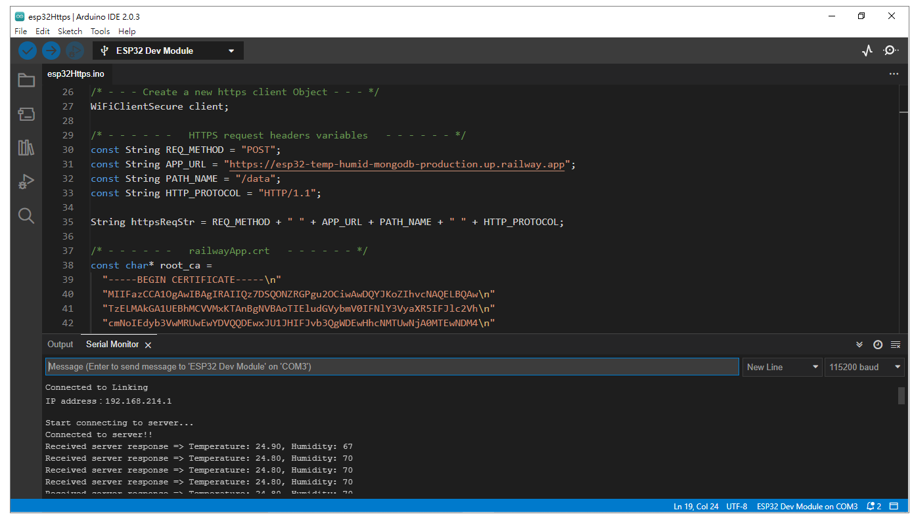
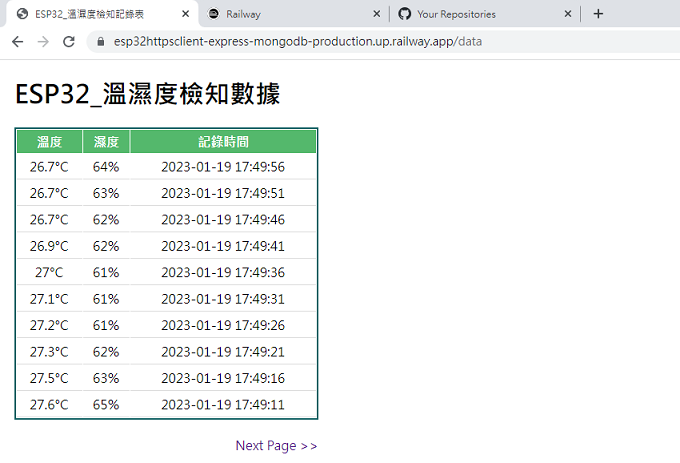
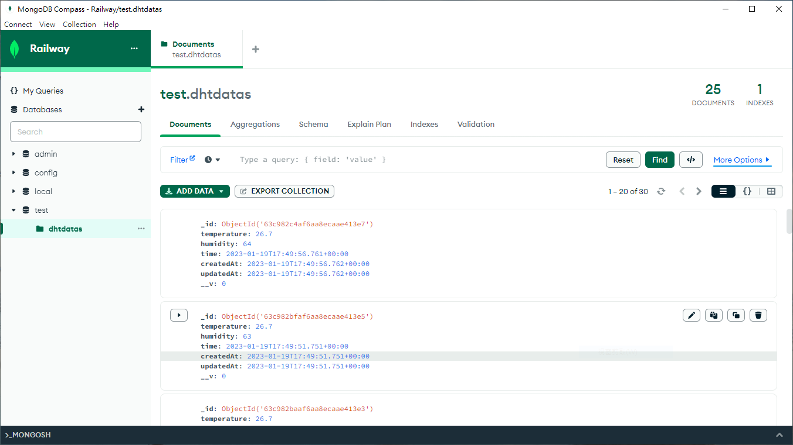
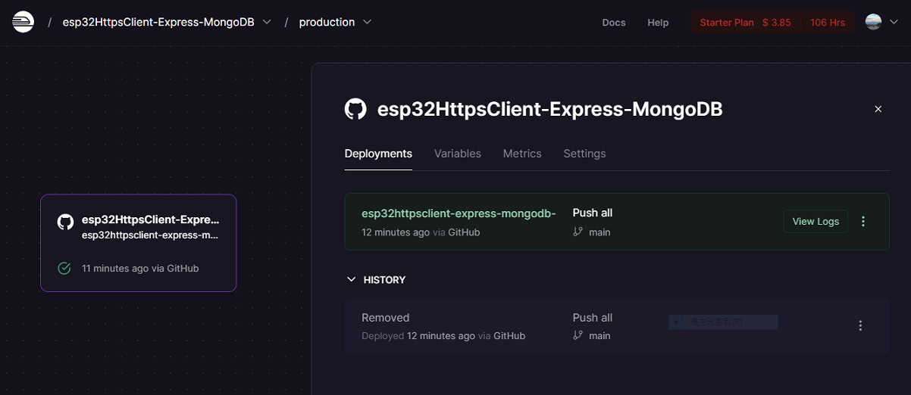
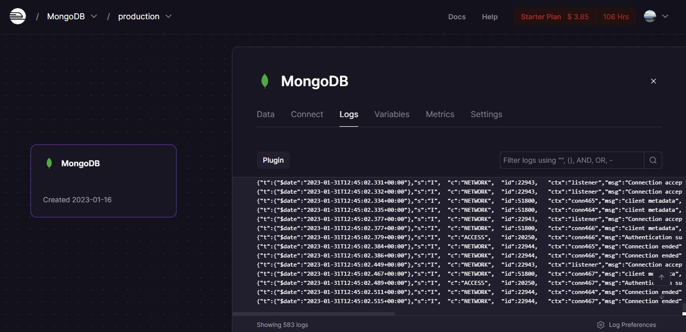

<h1 align="center">Real-time temperature and humidity monitoring system</h1>

  <a href="https://esp32httpsclient-express-mongodb-production.up.railway.app/data"><strong>Explore the website</strong></a>
   

## Table of contents

- [About the Project](#about-the-project)
- [System implementation episode 1：ESP32](#system-implementation-episode-1esp32)
- [System implementation episode 2：Express](#system-implementation-episode-2express)
- [System implementation episode 3：mongoose & MongoDB](#system-implementation-episode-3mongoose--mongodb)
- [System implementation episode 4：Deploy to Railway platform](#system-implementation-episode-4deploy-to-railway-platform)

## About the project

The real-time online platform integrating ESP32、Express routing and MongoDB allows you to easily monitor the temperature and humidity of the surrounding environment.

## System implementation episode 1：ESP32

ESP32 is mainly responsible for：

- Connect to WiFi.

- Make a https post request：
  - Send the https request headers and request body
  - Set up railway server certificate

- Capture temperature and humidity information through DHT11 sensor.

- Process and send the temperature and humidity data in JSON format to MongoDB.

***ESP32_ArduinoIDE_ExecutionScreenshot***：

## System implementation episode 2：Express

Express is mainly responsible for：

- Create web application routes.
- Create EJS webpage.
- Executing middlewares.
- Receive and process https post request.

***EJS_WebPage***：

## System implementation episode 3：mongoose & MongoDB

mongoose & MongoDB are mainly responsible for：

- Create database schema and model.
- Connect to MongoDB server.
- Collaborate with Express for CRUD operations.

***MongoDB_Compass_ExecutionScreenshot***：

## System implementation episode 4：Deploy to Railway platform

***Railway_GitProjectDeploy***：

***Railway_MongoDBDeploy***：

